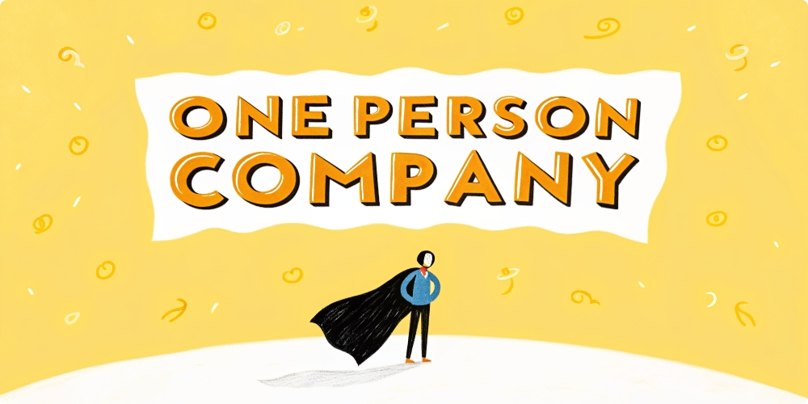

A curated collection of AI tools for one-person companies - some are gems, others are pitfalls

This repo helps you avoid the traps and find the real treasures 🤩

Please star 🌟, bookmark, and share!

 

  
<kbd>Table of Contents</kbd>

#### Table of Contents

- [🌟 Part 1: Essential Daily Tools](#-part-1-essential-daily-tools)
  - [🤖 AI Chat](#-ai-chat)
  - [🎨 Media Creation](#-media-creation)
  - [🎯 UI Design](#-ui-design)
  - [💻 IDE](#-ide)
  - [📟 Command Line](#-command-line)
  - [🌐 Browser](#-browser)
  - [🎥 Video Recording](#-video-recording)
  - [📊 Flowcharts](#-flowcharts)
  - [🎨 Banner](#-banner)
  - [📐 Architecture Diagrams](#-architecture-diagrams)
  - [🌐 SAAS Website Building](#-saas-website-building)
- [🚀 Part 2: One-Click Website/App Generation](#-part-2-one-click-websiteapp-generation)
  - [📊 Platform Comparison](#platform-comparison)
- [🛠 Part 3: Daily Tools](#-part-3-daily-tools)
  - [⚙️ System Enhancement](#system-enhancement)
  - [🎥 Media Tools](#media-tools)
  - [⚡ Productivity Tools](#productivity-tools)

####

 

## 🏢 One Person Company - AI Tools Collection

### 🌟 Part 1: Essential Daily Tools

| Category | Tool | Pricing |
|----------|------|---------|
| 🤖 AI Chat | [Grok.com](http://Grok.com) | Free tier |
| 🎨 Media Creation | [KlingAI.com](http://klingai.com) | Free tier |
| 🎯 UI Design | [Relume.io](http://Relume.io) | Free trial |
| 💻 IDE | [TRAE.ai](http://TRAE.ai) + [Cursor.com](http://Cursor.com) | Free until 3.7 + Free |
| 📟 Command Line | [Warp.dev](http://warp.dev) | Free |
| 🌐 Browser | [Deta.Surf](http://deta.Surf) | Beta, free until 3.7 |
| 🎥 Video Recording | [CapCut](https://www.capcut.cn/) | Free |
| 📊 Flowcharts | [Napkin.ai](http://Napkin.ai) | Free |
| 🎨 Banner | [Canva.com](http://Canva.com) | Free tier |
| 📐 Architecture | [Excalidraw.com](http://Excalidraw.com) | Free |
| 🌐 SAAS Building | [Webflow.com](http://Webflow.com) + [Framer.com](http://framer.com) | Free templates |

 

### 🚀 Part 2: One-Click Website/App Generation

### Platform Comparison

| Platform | Time | Features | Demo |
|----------|------|----------|------|
| [v0.dev](http://v0.dev) | ~2min | Fastest, no watermark | [Example](http://v0-saa-s-landing-page-zucn5j.vercel.app) |
| [lovable.dev](http://lovable.dev) | ~3min | Best looking | [Example](http://fab-landing-magic.lovable.app) |
| [bolt.new](http://bolt.new) | ~3min | Good UX, no watermark | [Example](http://frabjous-liger-0a7f6a.netlify.app) |
| [heyboss.xyz](http://heyboss.xyz) | ~12min | $10 free credit | [Example](http://4debce98.heyboss.tech/f28ae845) |
| [replit.com](http://replit.com) | ~4min | Card required, $25/month credit | - |

 

### 🛠 Part 3: Daily Tools (Mac & Windows)

#### System Enhancement
- 🔍 **[Raycast](http://raycast.com)** - Spotlight replacement, all-in-one search tool (Free tier)
- 🪟 **[Rectangle](http://rectangleapp.com)** - Window management tool (Free)
- ⌨️ **[Karabiner-Elements](http://karabiner-elements.pqrs.org)** - Keyboard customization tool (Open source)
- 🔧 **[Ice](http://github.com/jordanbaird/Ice)** - System toolbar customization (Open source)

#### Media Tools
- 📸 **[PixPin](https://pixpin.cn)** - All-in-one screenshot tool (Windows, Free)
  - Supports scrolling screenshots, GIF recording, OCR
  - Screen pinning feature for reference
  - Rich annotation tools
- 🎥 **[MotionShot](https://www.motionshot.io)** - Interactive demo recording tool
  - Professional product demos and tutorials
  - Interactive hotspot annotations
  - Pricing: $7/month or $140 lifetime
- 📸 **[Snipaste](http://snipaste.com)** - Screenshot tool (Free)
- 🎬 **[Kap](http://getkap.co)** - GIF recording tool (Open source)
- ⌨️ **[KeyCastr](http://github.com/keycastr/keycastr)** - Keystroke visualizer (Open source)
- 🎥 **[OBS](http://obsproject.com)** - Professional screen recording (Open source)
- 📺 **[IINA](http://iina.io)** - Modern media player (Open source)
- ⬇️ **[Downie](http://software.charliemonroe.net/downie)** - Video downloader (Free trial)

#### Productivity Tools
- 📟 **[Warp](http://warp.dev)** - AI-powered terminal (Free tier)
- 📋 **[Pastebot](http://tapbots.com/pastebot)** - Clipboard manager ($13 lifetime)
- 🔍 **[CleanShot](http://cleanshot.com)** - Advanced screenshot tool ($8/month, $29 lifetime)
- 🎁 **[Setapp](http://setapp.com)** - Software subscription bundle ($10/month)

---
*Note: All pricing and feature information is for reference only. Please check official websites for the latest details.*