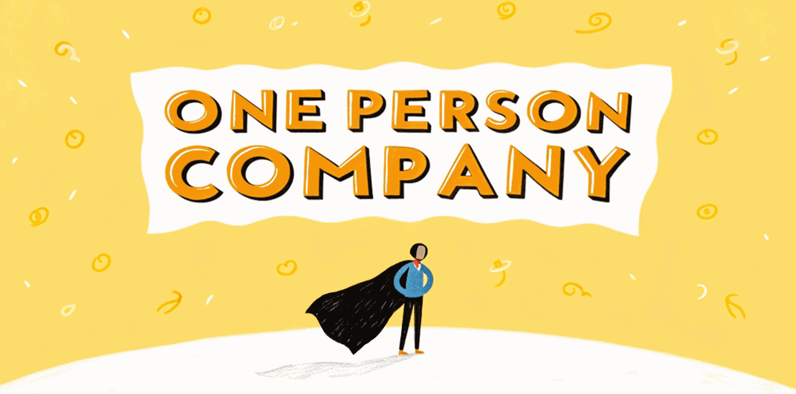

<h1>一人公司</h1>

一人公司 AI 工具系列，有些工具是宝，有些工具是坑

本 Repo 致力于帮您踩坑，精准找宝 🤩

欢迎点🌟 | 收藏🔖 | 转发🫰

[![GitHub stars][star-shield]][star-link]
[![GitHub forks][fork-shield]][fork-link]
[![GitHub issues][issue-shield]][issue-link]
[![GitHub pull requests][pr-shield]][pr-link]
[![GitHub license][license-shield]][license-link]

[![English Version][en-shield]][en-link]

 

  
<kbd>目录</kbd>

  ### 目录

- [🌟 第一弹：日常必备工具](#-第一弹日常必备工具)
  - [AI 对话](#ai-对话)
  - [图文视频](#图文视频)
  - [IDE](#ide)
  - [命令行](#命令行)
  - [浏览器](#浏览器)
- [🚀 第二弹：一键生成网站/App](#-第三弹一键生成网站app)
- [🛠 第三弹：日常工具篇](#-第四弹日常工具篇)
  - [系统增强](#系统增强)
  - [媒体工具](#媒体工具)
  - [效率工具](#效率工具)
- [🎨 第四弹：设计工具集合](#-第二弹设计工具集合)
  - [全能设计](#全能设计)
  - [运营设计](#运营设计)
  - [网站设计](#网站设计)
  - [Logo 设计](#logo-设计)
  - [3D 设计](#3d-设计)
  - [动态设计](#动态设计)
  - [工作流设计](#工作流设计)

 

## 🌟 第一弹：日常必备工具

- 🤖 **AI 对话**
  - [Grok][grok-link]
  - 强大的 AI 对话能力
  - 免费额度

- 🎨 **图文视频**
  - [KlingAI][kling-link] 
  - AI 驱动的创意工具
  - 免费额度

- 💻 **IDE**
  - [TRAE][trae-link] + [Cursor][cursor-link]
  - AI 辅助开发
  - 3.7免费用+免费

- 📟 **命令行**
  - [Warp][warp-link]
  - 现代化终端
  - 免费

- 🌐 **浏览器**
  - [Deta.Surf][deta-link]
  - AI 驱动浏览器
  - 内测免费

 

 

## 🚀 第二弹：一键生成网站/App/游戏

同一个提示词，「创建一个好看的 SAAS 落地页」，测试了各家情况，并部署上线

| 平台 | 耗时 | 特点 | 价格 | 演示 |
|:----:|:----:|:----:|:----:|:----:|
| [v0.dev][v0-link] | 2分钟 | 最快无水印 | 免费 | [查看][v0-demo-link] |
| [lovable][lovable-link] | 3分钟 | 最好看 | 免费 | [查看][lovable-demo-link] |
| [bolt.new][bolt-link] | 3分钟 | 体验好 | 免费 | [查看][bolt-demo-link] |
| [heyboss][heyboss-link] | 12分钟 | 送$10 | 免费 | [查看][heyboss-demo-link] |
| [replit][replit-link] | 4分钟 | $25/月额度 | 需绑卡 | - |

 

 

## 🛠 第三弹：效率提升工具

### 系统增强
- 🔍 **[Raycast][raycast-link]** - 效率启动器（免费）
- 🪟 **[Rectangle][rectangle-link]** - 窗口管理（免费）
- ⌨️ **[Karabiner][karabiner-link]** - 键盘定制（开源）
- 🔧 **[Ice][ice-link]** - 工具栏增强（开源）

### 媒体工具
- 📸 **[PixPin][pixpin-link]** - 全能截图（免费）
  - 支持长截图、GIF、OCR
  - 贴图功能方便参考
  - 丰富标注工具

- 🎥 **[MotionShot][motionshot-link]** - 演示录制
  - 专业演示制作
  - 交互式标注
  - $7/月或$140终身

- 🎬 **其他推荐工具**
  - [Snipaste][snipaste-link] - 截图（免费）
  - [Kap][kap-link] - GIF录制（开源）
  - [KeyCastr][keycastr-link] - 按键显示（开源）
  - [OBS][obs-link] - 专业录屏（开源）
  - [IINA][iina-link] - 视频播放器（开源）
  - [Downie][downie-link] - 视频下载（试用）

### 效率工具
- 📟 **[Warp][warp-link]** - AI 终端（免费额度）
- 📋 **[Pastebot][pastebot-link]** - 剪贴板（$13终身）
- 🔍 **[CleanShot][cleanshot-link]** - 截图（$29终身）
- 🎁 **[Setapp][setapp-link]** - 软件订阅（$10/月）

 

 

## 🎨 第四弹：设计工具集合

### 全能设计
- 🎨 **[Recraft.ai][recraft-link]** - AI 驱动的设计平台
  - ✨ 每天免费 100 次生成额度
  - 🎯 支持 Logo、图片、MockUp、Banner
  - 🔄 提供模板和风格定制
  - 🎁 [点击领取额外福利][recraft-invite-link]

### 运营设计
- 📱 **[Canva][canva-link]** - 全能设计平台
  - 📊 支持文档、白板、社媒、视频等
  - 🎨 海量模板一键修改
  - 💳 绑卡免费 30 天

### 网站设计
- 🌐 **[Relume][relume-link]** - AI 网站生成器
  - 🚀 一句话生成完整网站
  - 🔗 与 Figma 无缝集成
  - 💳 绑卡免费 30 天

### Logo 设计
| 平台 | 特点 | 价格 |
|:----:|:----:|:----:|
| [Fiverr][fiverr-link] | 专业设计平台 | 付费 |
| [Design.com][design-link] | AI 生成 | 免费试用 |
| [AILogoGenerator][ailogo-link] | 简单快速 | 免费 |
| [LogoMakr][logomakr-link] | 自定义强 | 免费 |
| [LogoPony][logopony-link] | 风格多样 | 免费试用 |
| [Looka][looka-link] | 品牌套件 | 免费试用 |

### 3D 设计
- 🎮 **[Blender][blender-link]** - 专业 3D 软件
  - 🆓 完全开源免费
  - 🤖 支持 AI 控制
  - 🔧 [MCP 控制器][blender-mcp-link]

- 🎨 **[Spline][spline-link]** - 轻量级 3D 设计
  - ✨ 社区免费模板
  - 📱 支持网页端设计
  - 🚀 快速上手

### 动态设计
- 🎬 **[Jitter][jitter-link]** - 动态设计工具
  - 🎯 专注 Hero 动画
  - ⚡ 简单易用
  - 🆓 免费版够用

- 🎥 **[HailuoAI][hailuo-link]** - AI 动态生成
  - 🎨 支持多种动态效果
  - 📱 适合社媒内容
  - 🆓 免费版够用

- 🎨 **[KlingAI][kling-link]** - 创意动态工具
  - 🤖 AI 驱动转换
  - 🎯 社媒优化
  - 🆓 免费版够用

### 工作流设计
- 📊 **[Overflow][overflow-link]** - 工作流设计
  - 🎨 界面美观
  - 📱 支持交互展示
  - 🆓 免费下载使用

 

## 点🌟收藏

*注：价格和功能信息仅供参考，请以官方网站为准。*

<!-- Shields -->
[star-shield]: https://img.shields.io/github/stars/cyfyifanchen/one-person-company?style=flat-square&logo=github&color=FFD700&logoColor=white&logoBackground=FFA500
[star-link]: https://github.com/cyfyifanchen/one-person-company/stargazers
[fork-shield]: https://img.shields.io/github/forks/cyfyifanchen/one-person-company?style=flat-square&logo=github&color=FFD700&logoColor=white&logoBackground=FFA500
[fork-link]: https://github.com/cyfyifanchen/one-person-company/network
[issue-shield]: https://img.shields.io/github/issues/cyfyifanchen/one-person-company?style=flat-square&logo=github&color=FFD700&logoColor=white&logoBackground=FFA500
[issue-link]: https://github.com/cyfyifanchen/one-person-company/issues
[pr-shield]: https://img.shields.io/github/issues-pr/cyfyifanchen/one-person-company?style=flat-square&logo=github&color=FFD700&logoColor=white&logoBackground=FFA500
[pr-link]: https://github.com/cyfyifanchen/one-person-company/pulls
[license-shield]: https://img.shields.io/github/license/cyfyifanchen/one-person-company?style=flat-square&logo=github&color=FFD700&logoColor=white&logoBackground=FFA500
[license-link]: https://github.com/cyfyifanchen/one-person-company/blob/main/LICENSE
[en-shield]: https://img.shields.io/badge/English-README-orange?style=for-the-badge&logo=markdown&logoColor=white
[en-link]: ./README-EN.md

<!-- Tool Links -->
[grok-link]: http://Grok.com
[kling-link]: http://klingai.com
[relume-link]: http://Relume.io
[trae-link]: http://TRAE.ai
[cursor-link]: http://Cursor.com
[warp-link]: http://warp.dev
[deta-link]: http://deta.Surf
[capcut-link]: https://www.capcut.cn/
[napkin-link]: http://Napkin.ai
[canva-link]: http://Canva.com
[excalidraw-link]: http://Excalidraw.com
[webflow-link]: http://Webflow.com
[framer-link]: http://framer.com

<!-- Website Generator Links -->
[v0-link]: http://v0.dev
[v0-demo-link]: http://v0-saa-s-landing-page-zucn5j.vercel.app
[lovable-link]: http://lovable.dev
[lovable-demo-link]: http://fab-landing-magic.lovable.app
[bolt-link]: http://bolt.new
[bolt-demo-link]: http://frabjous-liger-0a7f6a.netlify.app
[heyboss-link]: http://heyboss.xyz
[heyboss-demo-link]: http://4debce98.heyboss.tech/f28ae845
[replit-link]: http://replit.com

<!-- Daily Tools Links -->
[raycast-link]: http://raycast.com
[rectangle-link]: http://rectangleapp.com
[karabiner-link]: http://karabiner-elements.pqrs.org
[ice-link]: http://github.com/jordanbaird/Ice
[pixpin-link]: https://pixpin.cn
[motionshot-link]: https://motionshot.app
[snipaste-link]: http://snipaste.com
[kap-link]: http://getkap.co
[keycastr-link]: http://github.com/keycastr/keycastr
[obs-link]: http://obsproject.com
[iina-link]: http://iina.io
[downie-link]: http://software.charliemonroe.net/downie
[pastebot-link]: http://tapbots.com/pastebot
[cleanshot-link]: http://cleanshot.com
[setapp-link]: http://setapp.com

<!-- Design Tool Links -->
[recraft-link]: http://recraft.ai
[recraft-invite-link]: http://recraft.ai/invite/YB1Vrv0YOG
[design-link]: http://design.com/ai-logo-generator
[ailogo-link]: http://ailogogenerator.net
[logomakr-link]: http://logomakr.com
[logopony-link]: http://logopony.com
[looka-link]: http://looka.com
[blender-link]: http://blender.org
[spline-link]: http://spline.design
[jitter-link]: http://jitter.video
[hailuo-link]: http://hailuoai.com/video
[overflow-link]: http://overflow.io
[fiverr-link]: https://www.fiverr.com/categories/graphics-design/creative-logo-design
