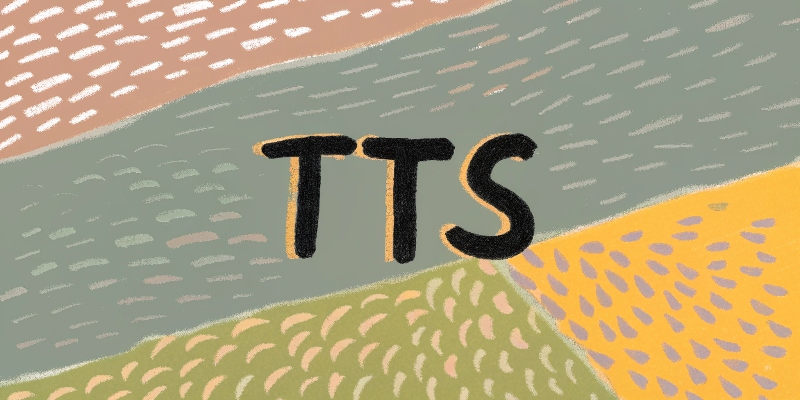
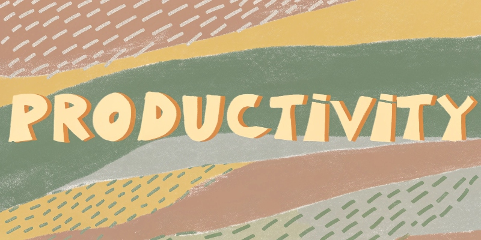
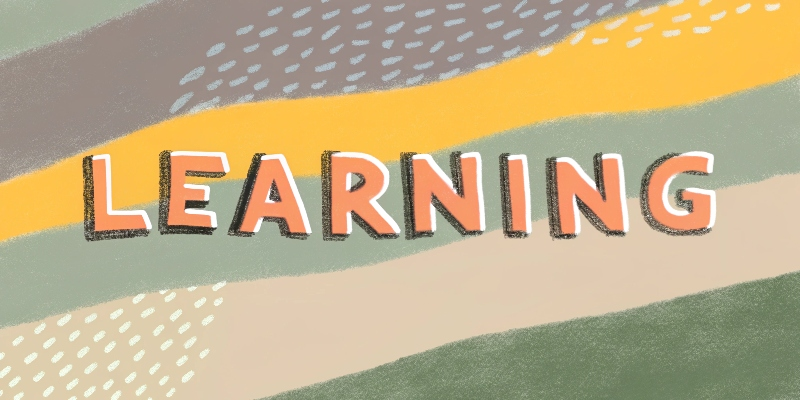

<h1>一人公司</h1>

一人公司 AI 工具系列，有些工具是宝，有些工具是坑

本 Repo 致力于帮您踩坑，精准找宝 🤩

欢迎点🌟 | 收藏🔖 | 转发🫰

[![GitHub stars][star-shield]][star-link]
[![GitHub forks][fork-shield]][fork-link]
[![GitHub issues][issue-shield]][issue-link]
[![GitHub pull requests][pr-shield]][pr-link]
[![GitHub license][license-shield]][license-link]

[![English Version][en-shield]][en-link]

 

  
<kbd>目录</kbd>

  ### 目录

- [🤖 大语言模型](#-大语言模型)
  - [模型对比与排名](#-chatbot-arena-实时排行)
- [🗣️ TTS](#-tts)
- [💻 代码](#-代码)
  - [IDE](#ide)
  - [命令行终端](#命令行终端)
- [🎨 设计工具](#-设计工具)
  - [全能设计](#全能设计)
  - [运营设计](#运营设计)
  - [网站设计](#网站设计)
  - [3D 设计](#3d-设计)
  - [动态设计](#动态设计)
  - [工作流设计](#工作流设计)
  - [Logo 设计](#logo-设计)
- [⚙️ 生产力工具](#-生产力工具)
  - [系统增强](#系统增强)
  - [媒体工具](#媒体工具)
  - [日常效率](#日常效率)
- [🌐 网站系列](#-网站系列---一键生成网站)
  - [一键生成网站](#-网站系列---一键生成网站)
- [📚 学习系列](#-学习系列)
- [点🌟收藏](#点收藏)

 

## 🤖 大语言模型

在日常使用中，我主要依赖 GPT-4o 和 DeepSeek-V2 来处理文案创作和一般性问题。两者各有优势:GPT-4o 的回答更加全面和人性化，而 DeepSeek-V2 则在中文语境下表现出色。当遇到这两个模型给出不同答案时，我会使用 Grok 作为第三方意见来帮助判断。

在编程方面，我主要使用 Claude 3 Sonnet 和 Claude 3.5。这两个模型在代码理解、生成和调试方面都表现优异，特别是在处理复杂的编程任务时更为可靠。

至于 Gemini 2，虽然功能强大，但目前的使用体验还不够稳定。我偶尔会用它来尝试一些特定任务，但并不作为主力工具。

#### 📊 Chatbot Arena 实时排行
由 LMSYS 团队维护，基于真实用户盲测，极具参考价值  🔗 https://chat.lmsys.org/?leaderboard

| 模型 | 简介 | Chatbot Arena 排名 |
|------|------|---------------------|
| [ChatGPT-4o (OpenAI)](https://openai.com/chatgpt) | 多模态旗舰模型，支持图像、语音和实时响应 | 🥇 [#1](https://chat.lmsys.org/?leaderboard) |
| [Claude 3.5 Sonnet (Anthropic)](https://www.anthropic.com/index/claude-3-5-sonnet) | Claude 最新中高端模型，擅长写作、编程与推理 | 🥈 [#2](https://chat.lmsys.org/?leaderboard) |
| [Gemini 1.5 (Google)](https://deepmind.google/technologies/gemini/) | Google 大语言模型，长上下文、多模态能力强 | 🏅 Top 10 |
| [DeepSeek-V2](https://github.com/deepseek-ai/DeepSeek-V2) | 中文/代码能力优秀，完全开源 | 🏅 Top 10 |
| [Grok (xAI)](https://x.ai) | X 平台生态内置 AI，更偏实用和辅助信息流 | ❓ 暂无 Arena 排名 |
| [Alama (评测平台)](https://alama.ai) | 开源模型评测平台，可查看多模型横评结果 | ✅ 模型对比聚合平台 |

[![][back-to-top]](#readme-top)

 

## 🗣️ TTS

### 🏢 商业 TTS 服务（英文 + 多语言）

#### 1. [Microsoft Azure TTS](https://azure.microsoft.com/en-us/products/cognitive-services/text-to-speech/)
- ✅ 多语言高保真语音（中文支持极佳）
- ✅ 支持 SSML 控制、情绪语调、流式播放
- ✅ 免费 5M 字符/月（前 12 个月）

#### 2. [Google Cloud TTS](https://cloud.google.com/text-to-speech)
- ✅ WaveNet / Neural2 语音，高自然度
- ✅ 支持中文普通话和台语，声音种类丰富
- ✅ 免费 4M 字符/月（前 12 个月）

#### 3. [Amazon Polly](https://aws.amazon.com/polly/)
- ✅ 稳定、可部署在 AWS 各产品中
- ✅ 多语言、支持 Speech Marks（断句）
- ✅ 免费 5M 字符/月（前 12 个月）

#### 4. [IBM Watson TTS](https://www.ibm.com/cloud/watson-text-to-speech)
- ✅ 多语种中规中矩，适合企业内嵌产品
- ✅ 商业定价合理，稳定可靠

#### 5. [ElevenLabs](https://elevenlabs.io/)
- ✅ 音色极其自然，支持情绪变化与角色风格
- ✅ 英文最强，中文支持中等，支持语音克隆
- ✅ 免费试用，支持流式播放 API

#### 6. [PlayHT](https://play.ht/)
- ✅ 清晰流畅，支持 Web 端流式 TTS
- ✅ 有免费层（注册后获取 token）

#### 7. [OpenAI TTS](https://platform.openai.com/docs/guides/text-to-speech)
- ✅ 语音自然，支持 Whisper 语音识别对接
- ❌ 目前中文支持较弱

#### 8. [Deepgram](https://deepgram.com/product/text-to-speech)
- ✅ 实时流式 TTS，延迟低
- ✅ 支持多种语言和声音风格
- ✅ 提供免费试用额度

#### 9. [Neuphonic](https://neuphonic.ai)
- ✅ 支持多语言、多音色、多情绪
- ✅ 提供 API 和 SDK 集成
- ✅ 有免费试用额度

#### 10. [Murf AI](https://murf.ai/)
- ✅ 专业级配音和画外音制作
- ✅ 支持 120+ 种声音和 20+ 种语言
- ✅ 提供免费试用

#### 11. [Resemble AI](https://www.resemble.ai/)
- ✅ 高度自然的语音克隆技术
- ✅ 支持实时语音合成
- ✅ 企业级 API 服务

 

### 🇨🇳 优秀中文 TTS 服务

#### 1. [iFlytek 科大讯飞](https://www.xfyun.cn/services/online_tts)
- ✅ 地表最强中文 TTS，情绪语调、音色多样
- ✅ 支持流式推理、自定义音色、音色克隆
- ✅ 广泛应用于教育、客服、阅读等场景

#### 2. [Baidu TTS](https://ai.baidu.com/tech/speech/tts)
- ✅ 支持离线 SDK 与云调用，音色稳健
- ✅ 语音合成准确，适合企业级语音交互

#### 3. [MiniMax TTS](https://blog.fal.ai/minimax-text-to-speech-models-now-available-on-fal/)
- ✅ 语速快，延迟低，实时响应
- ✅ 多语言音色支持，适合 AI Agent 场景

#### 4. ByteDance（字节跳动）SeedTTS / MegaTTS3
- ✅ 中文表现优异，音色高度真实
- ✅ 支持语音克隆、多情绪表达，主要用于内部产品（抖音、剪映）

#### 5. [Cartesia Sonic TTS](https://cartesia.ai/product/text-to-speech-tts)
- ✅ 延迟低（40ms），可控性强，3秒音色克隆
- ✅ 上下文理解力强，适合医疗、客服等领域

#### 6. [Fish Speech](https://github.com/fishaudio/fish-speech)
- ✅ 开源中文语音合成系统
- ✅ 支持多语言、音色克隆
- ✅ 流式推理，易于部署

#### 7. [CosyVoice (阿里巴巴)](https://github.com/FunAudioLLM/CosyVoice)
- ✅ 开源多语言语音合成系统
- ✅ 支持情感语调、多语种训练
- ✅ 轻量化部署，流式推理

#### 8. [火山引擎 TTS](https://www.volcengine.com/product/speech-tech)
- ✅ 支持中英文双语、多音色
- ✅ 提供流式合成和离线 SDK
- ✅ 企业级服务支持

 

### 🔓 开源/自部署 TTS（中英文混合）

#### 1. [Fish Speech](https://github.com/fishaudio/fish-speech)
- ✅ 支持中文、英文、日文、德文等 8 种语言
- ✅ 支持音色克隆，开箱即用，可部署流式播放

#### 2. [CosyVoice (阿里)](https://github.com/FunAudioLLM/CosyVoice)
- ✅ 支持中文/英文/日语等，情感语调、多语种训练
- ✅ 支持流式推理、轻量化部署

#### 3. [Coqui TTS](https://github.com/coqui-ai/TTS)
- ✅ 支持中文模型（需配置），多语种开源支持
- ✅ 可自训练/微调，社区活跃，语音质量稳定

#### 4. [Mimic (Mycroft AI)](https://github.com/MycroftAI/mimic1)
- ✅ 轻量语音合成器，适用于嵌入式、对话系统

#### 5. [Bark (by Suno)](https://github.com/suno-ai/bark)
- ✅ 多模态输出（语音、语气、非语言元素）
- ⚠️ 生成延迟高，不支持流式

#### 6. [Tortoise TTS](https://github.com/neonbjb/tortoise-tts)
- ✅ 高质量朗读级语音，适合播客/视频
- ❌ 非实时，生成速度慢

#### 7. [VITS](https://github.com/jaywalnut310/vits)
- ✅ 端到端语音合成模型
- ✅ 支持多语言训练
- ✅ 社区活跃，有多个改进版本

 

### 📊 功能对比表（中英文 TTS）

| 名称            | 中文 | 英文 | 流式 | 克隆 | 开源 | 特点                 | 价格 |
|-----------------|------|------|------|------|------|----------------------|------|
| Azure TTS       | ✅✅✅ | ✅✅✅ | ✅   | ❌   | ❌   | 商业标准，情感支持强 | $16/百万字符 |
| Google TTS      | ✅✅  | ✅✅✅ | ⚠️   | ❌   | ❌   | 稳定好用             | $16/百万字符 |
| iFlytek         | ✅✅✅ | ✅    | ✅   | ✅   | ❌   | 中文第一             | ¥0.2/千字符 |
| MiniMax         | ✅✅  | ✅    | ✅   | ✅   | ❌   | 适合 Agent           | ¥0.3/千字符 |
| Baidu TTS       | ✅✅  | ❌    | ✅   | ❌   | ❌   | 企业级可落地         | ¥0.2/千字符 |
| ByteDance TTS   | ✅✅✅ | ✅    | ✅   | ✅✅ | ❌   | 中文高保真 + 情绪    | 内部使用 |
| Cartesia Sonic  | ✅✅✅ | ✅    | ✅✅ | ✅✅ | ❌   | 高速、准确、可控     | 企业定制 |
| ElevenLabs      | ⚠️    | ✅✅✅ | ✅   | ✅   | ❌   | 角色感强，音质好     | $22/百万字符 |
| Murf AI         | ❌    | ✅✅✅ | ✅   | ✅   | ❌   | 专业配音级           | $29/月起 |
| Resemble AI     | ⚠️    | ✅✅  | ✅   | ✅✅ | ❌   | 克隆技术领先         | 企业定制 |
| 火山引擎 TTS    | ✅✅  | ✅    | ✅   | ❌   | ❌   | 企业级服务           | ¥0.3/千字符 |
| Fish Speech     | ✅✅  | ✅    | ✅   | ✅   | ✅   | 快速开源部署         | 免费 |
| CosyVoice       | ✅✅  | ✅    | ✅   | ✅   | ✅   | 多语 + 轻量          | 免费 |
| Coqui TTS       | ✅（需配置）| ✅ | ⚠️   | ✅   | ✅   | 可训练，社区活跃     | 免费 |
| Bark            | ✅    | ✅    | ❌   | ✅   | ✅   | 情绪丰富，生成慢     | 免费 |
| Tortoise TTS    | ✅    | ✅✅  | ❌   | ✅   | ✅   | 高质量非实时输出     | 免费 |
| VITS            | ✅    | ✅    | ⚠️   | ✅   | ✅   | 端到端训练           | 免费 |

 

[![][back-to-top]](#readme-top)

 

## 💻 代码

- **IDE**
  - [TRAE][trae-link]
  - [Cursor][cursor-link]
    - AI 辅助开发
    - 3.7 免费用 + 免费
  - [VS Code][vscode-link]
    - 开源免费
    - 插件丰富
  - [Windsurf][windsurf-link]
    - 轻量级开发工具
    - 完全免费

- **命令行终端**
  - [Warp][warp-link]
    - AI 增强终端
    - 提供免费额度

[![][back-to-top]](#readme-top)

 

## 🎨 设计工具

### 全能设计
| 工具 | 特点 | 定价 |
|------|------|------|
| [Recraft.ai][recraft-link] | 🔥🔥🔥 强烈推荐 支持 Logo、图片、MockUp、Banner 提供模板和风格定制 | 每天免费 100 次生成额度 |

### 运营设计
| 工具 | 特点 | 定价 |
|------|------|------|
| [Canva][canva-link] | 支持文档、白板、社媒、视频等 海量模板一键修改 | 绑卡免费 30 天 |

### 网站设计
| 工具 | 特点 | 定价 |
|------|------|------|
| [Relume][relume-link] | 一句话生成完整网站 与 Figma 无缝集成 | 绑卡免费 30 天 |

### 3D 设计
| 工具 | 特点 | 定价 |
|------|------|------|
| [Blender][blender-link] | 支持 AI 控制 [MCP 控制器][blender-mcp-link] | 完全开源免费 |
| [Spline][spline-link] | 社区免费模板 支持网页端设计 快速上手 | 免费使用 |

### 动态设计
| 工具 | 特点 | 定价 |
|------|------|------|
| [Jitter][jitter-link] | 专注 Hero 动画 简单易用 | 免费版够用 |
| [HailuoAI][hailuo-link] | 支持多种动态效果 适合社媒内容 | 免费版够用 |
| [KlingAI][kling-link] | AI 驱动转换 社媒优化 | 免费版够用 |

### 工作流设计
| 工具 | 特点 | 定价 |
|------|------|------|
| [Overflow][overflow-link] | 界面美观 支持交互展示 | 免费下载使用 |

### Logo 设计
| 工具 | 特点 | 定价 |
|------|------|------|
| [Fiverr][fiverr-link] | 专业设计平台 | 付费服务 |
| [Design.com][design-link] | AI 生成 | 免费试用 |
| [AILogoGenerator][ailogo-link] | 简单快速 | 完全免费 |
| [LogoMakr][logomakr-link] | 自定义强 | 免费使用 |
| [LogoPony][logopony-link] | 风格多样 | 免费试用 |
| [Looka][looka-link] | 品牌套件 | 免费试用 |

[![][back-to-top]](#readme-top)

 

## ⚙️ 生产力工具

### 系统增强
- [Raycast][raycast-link]
  - 🔥🔥🔥 强烈推荐
  - 快速启动器
  - 工作流自动化
  - 基础功能免费

- [Karabiner][karabiner-link]
  - 🔥🔥🔥 强烈推荐
  - 键盘自定义
  - 功能强大
  - 开源免费

- [Rectangle][rectangle-link]
  - 窗口管理工具
  - 快捷键操作
  - 完全免费

- [Ice][ice-link]
  - 工具栏增强
  - 轻量高效
  - 开源免费

### 媒体工具

- [PixPin][pixpin-link]
  - 🔥🔥🔥 强烈推荐
  - 全能截图工具
  - 支持 GIF 录制
  - OCR 文字识别
  - 丰富标注功能

- [Downie][downie-link]
  - 🔥 推荐
  - 视频下载工具
  - 支持多平台
  - 提供试用
  - 视频下载工具
  - 支持多平台
  - 提供试用

- [MotionShot][motionshot-link]
  - 专业演示录制
  - 交互式标注
  - $7/月或$140 终身

- [Kap][kap-link]
  - GIF 录制工具
  - 简单易用
  - 开源免费

- [KeyCastr][keycastr-link]
  - 按键显示工具
  - 录制演示必备
  - 开源免费

- [OBS][obs-link]
  - 专业录屏软件
  - 直播推流
  - 开源免费

- [IINA][iina-link]
  - 现代视频播放器
  - 界面美观
  - 开源免费

### 日常效率
- [Pastebot][pastebot-link]
  - 剪贴板管理
  - 历史记录
  - $13 终身授权

- [CleanShot][cleanshot-link]
  - 专业截图工具
  - 录屏功能
  - $29 终身授权

- [Setapp][setapp-link]
  - 应用订阅合集
  - 优质应用精选
  - $10/月订阅

[![][back-to-top]](#readme-top)

 

## 网站系列 - 一键生成网站

- [v0.dev][v0-link]
  - 耗时：2分钟
  - 特点：最快无水印
  - 价格：免费
  - 演示：[查看][v0-demo-link]

- [lovable][lovable-link]
  - 耗时：3分钟
  - 特点：最好看
  - 价格：免费
  - 演示：[查看][lovable-demo-link]

- [bolt.new][bolt-link]
  - 耗时：3分钟
  - 特点：体验好
  - 价格：免费
  - 演示：[查看][bolt-demo-link]

- [heyboss][heyboss-link]
  - 耗时：12分钟
  - 特点：送$10
  - 价格：免费
  - 演示：[查看][heyboss-demo-link]

- [replit][replit-link]
  - 耗时：4分钟
  - 特点：$25/月额度
  - 价格：需绑卡
  - 演示：-

[![][back-to-top]](#readme-top)

 

## 📚 学习系列

 *coming soon*

[![][back-to-top]](#readme-top)

## 点🌟收藏

*注：价格和功能信息仅供参考，请以官方网站为准。*

<!-- Shields -->
[back-to-top]: https://img.shields.io/badge/-Back_to_top-gray?style=flat-square
[star-shield]: https://img.shields.io/github/stars/cyfyifanchen/one-person-company?style=flat-square&logo=github&color=FFD700&logoColor=white&logoBackground=FFA500
[star-link]: https://github.com/cyfyifanchen/one-person-company/stargazers
[fork-shield]: https://img.shields.io/github/forks/cyfyifanchen/one-person-company?style=flat-square&logo=github&color=FFD700&logoColor=white&logoBackground=FFA500
[fork-link]: https://github.com/cyfyifanchen/one-person-company/network
[issue-shield]: https://img.shields.io/github/issues/cyfyifanchen/one-person-company?style=flat-square&logo=github&color=FFD700&logoColor=white&logoBackground=FFA500
[issue-link]: https://github.com/cyfyifanchen/one-person-company/issues
[pr-shield]: https://img.shields.io/github/issues-pr/cyfyifanchen/one-person-company?style=flat-square&logo=github&color=FFD700&logoColor=white&logoBackground=FFA500
[pr-link]: https://github.com/cyfyifanchen/one-person-company/pulls
[license-shield]: https://img.shields.io/github/license/cyfyifanchen/one-person-company?style=flat-square&logo=github&color=FFD700&logoColor=white&logoBackground=FFA500
[license-link]: https://github.com/cyfyifanchen/one-person-company/blob/main/LICENSE
[en-shield]: https://img.shields.io/badge/English-README-orange?style=for-the-badge&logo=markdown&logoColor=white
[en-link]: ./README-EN.md

<!-- Tool Links -->
[grok-link]: http://Grok.com
[kling-link]: http://klingai.com
[relume-link]: http://Relume.io
[trae-link]: http://TRAE.ai
[cursor-link]: http://Cursor.com
[warp-link]: http://warp.dev
[deta-link]: http://deta.Surf
[capcut-link]: https://www.capcut.cn/
[napkin-link]: http://Napkin.ai
[canva-link]: http://Canva.com
[excalidraw-link]: http://Excalidraw.com
[webflow-link]: http://Webflow.com
[framer-link]: http://framer.com

<!-- Website Generator Links -->
[v0-link]: http://v0.dev
[v0-demo-link]: http://v0-saa-s-landing-page-zucn5j.vercel.app
[lovable-link]: http://lovable.dev
[lovable-demo-link]: http://fab-landing-magic.lovable.app
[bolt-link]: http://bolt.new
[bolt-demo-link]: http://frabjous-liger-0a7f6a.netlify.app
[heyboss-link]: http://heyboss.xyz
[heyboss-demo-link]: http://4debce98.heyboss.tech/f28ae845
[replit-link]: http://replit.com

<!-- Daily Tools Links -->
[raycast-link]: http://raycast.com
[rectangle-link]: http://rectangleapp.com
[karabiner-link]: http://karabiner-elements.pqrs.org
[ice-link]: http://github.com/jordanbaird/Ice
[pixpin-link]: https://pixpin.cn
[motionshot-link]: https://motionshot.app
[snipaste-link]: http://snipaste.com
[kap-link]: http://getkap.co
[keycastr-link]: http://github.com/keycastr/keycastr
[obs-link]: http://obsproject.com
[iina-link]: http://iina.io
[downie-link]: http://software.charliemonroe.net/downie
[pastebot-link]: http://tapbots.com/pastebot
[cleanshot-link]: http://cleanshot.com
[setapp-link]: http://setapp.com

<!-- Design Tool Links -->
[recraft-link]: http://recraft.ai
[recraft-invite-link]: http://recraft.ai/invite/YB1Vrv0YOG
[design-link]: http://design.com/ai-logo-generator
[ailogo-link]: http://ailogogenerator.net
[logomakr-link]: http://logomakr.com
[logopony-link]: http://logopony.com
[looka-link]: http://looka.com
[blender-link]: http://blender.org
[spline-link]: http://spline.design
[jitter-link]: http://jitter.video
[hailuo-link]: http://hailuoai.com/video
[overflow-link]: http://overflow.io
[fiverr-link]: https://www.fiverr.com/categories/graphics-design/creative-logo-design
[vscode-link]: https://code.visualstudio.com
[windsurf-link]: https://www.windsurfapp.com

